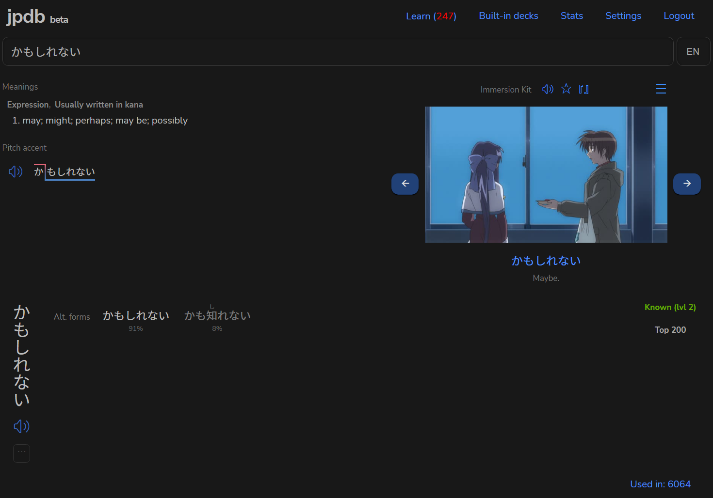
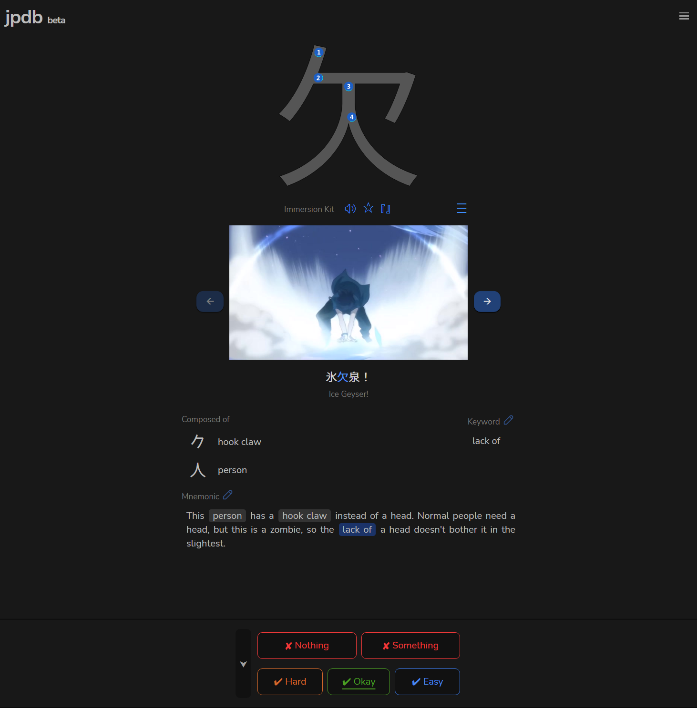
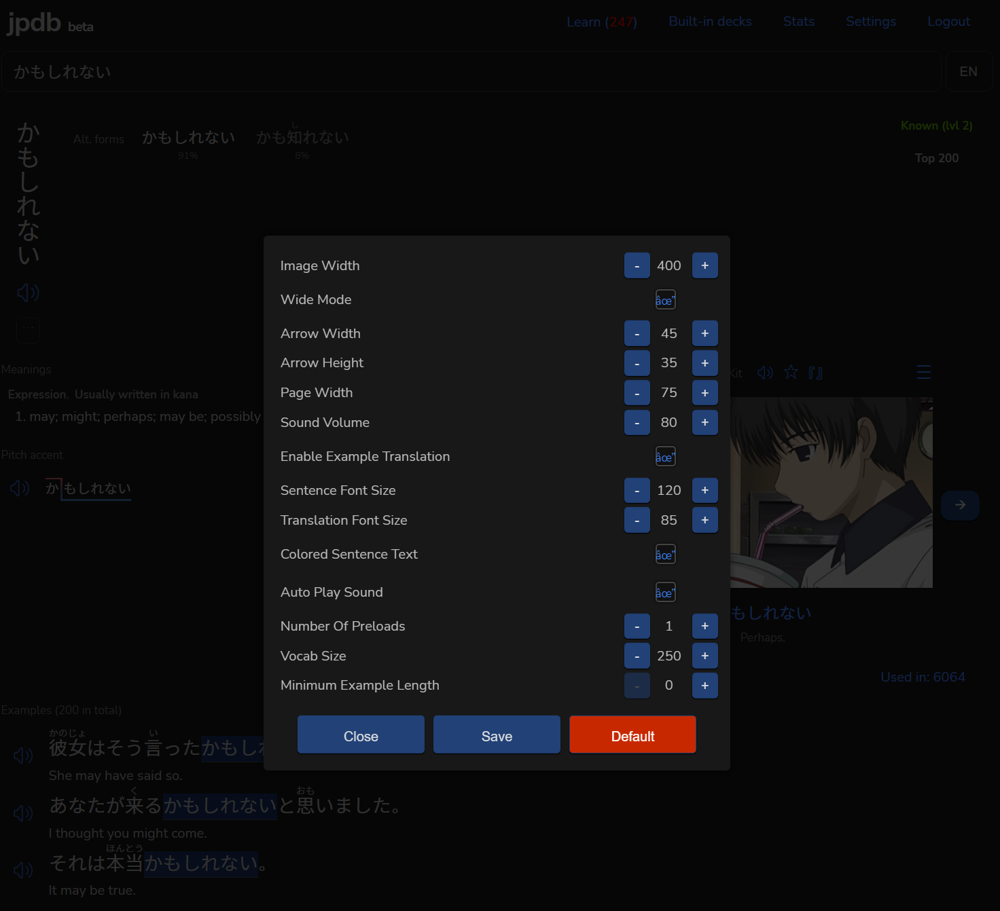

Just does a fetch to the public immersion-kit api with the word of the open jpdb.io page and updates the html to include the image preview + audio.

Inspired by [JPDB-Immersion-Kit-Examples](https://github.com/AwooDesu/JPDB-Immersion-Kit-Examples)

